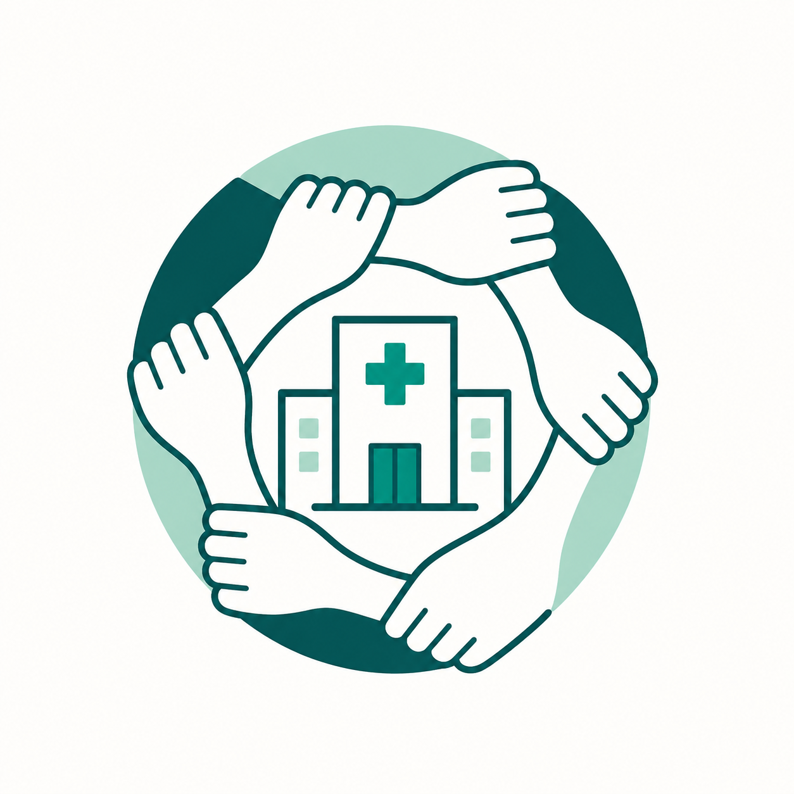
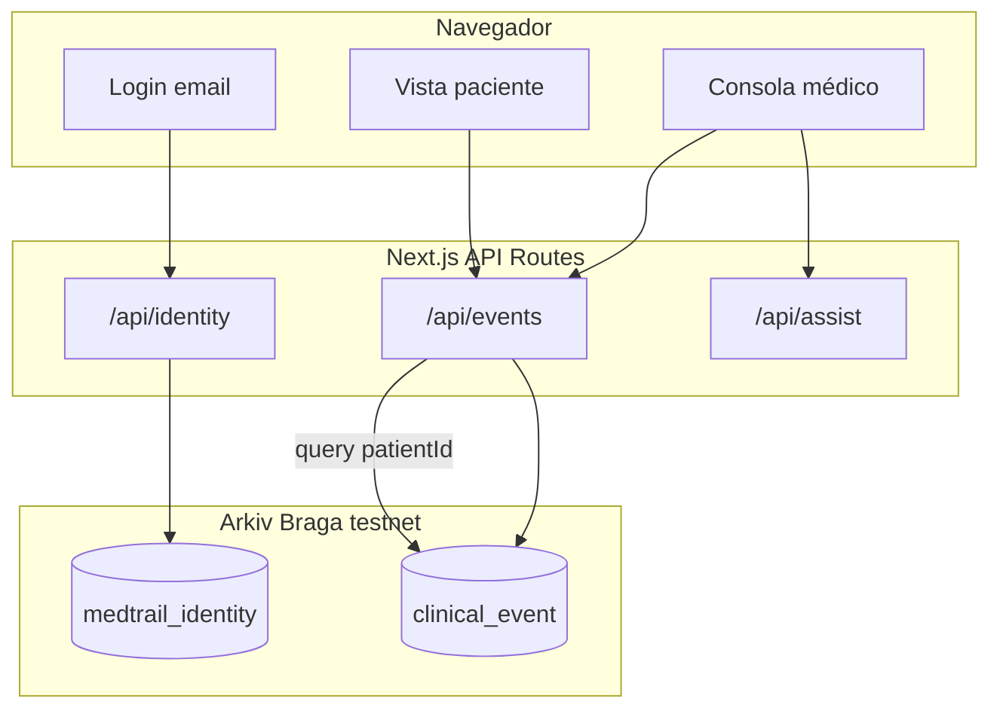

<p align="center">
  
</p>

<h1 align="center">InforMed</h1>

<p align="center">
  <strong>Historial clínico compartido entre hospitales — cada evento verificable en Arkiv</strong>
</p>

<p align="center">
  <a href="https://infor-med.vercel.app"></a>
  <a href="https://arkiv.network"></a>
  <a href="https://nextjs.org"></a>
  <a href="https://www.punatech.ar/guia/tracks/arkiv/"></a>
</p>

<p align="center">
  
  
  
  
  
</p>

---

## Para jurados (TL;DR)

| | |
|---|---|
| **Problema** | Historiales fragmentados por hospital; en urgencias no se ve lo registrado en otro centro. |
| **Solución** | Timeline unificado por paciente; cada evento = **entidad Arkiv** en Braga, consultable y verificable. |
| **Demo** | [infor-med.vercel.app](https://infor-med.vercel.app) → `medico@demo.com` → registrar evento → **Ver entidad en Arkiv** → cambiar hospital → mismo registro. |
| **Prueba on-chain** | Links en toast y modal a `data.arkiv.network` y explorer Braga (no es mock). |
| **Docs** | [Guía demo](./docs/DEMO.md) · [Arkiv](./docs/ARKIV.md) · [Diseño](./docs/DESIGN.md) |

---

## Tabla de contenidos

- [Problema y propuesta](#problema-y-propuesta)
- [Demo en 2 minutos](#demo-en-2-minutos)
- [Cuentas de prueba](#cuentas-de-prueba)
- [Verificación on-chain](#verificación-on-chain)
- [Arquitectura](#arquitectura)
- [Funcionalidades](#funcionalidades)
- [Modelo de datos Arkiv](#modelo-de-datos-arkiv)
- [Sistema de diseño](#sistema-de-diseño)
- [Stack técnico](#stack-técnico)
- [Estructura del proyecto](#estructura-del-proyecto)
- [Instalación local](#instalación-local)
- [Deploy (Vercel)](#deploy-vercel)
- [Scripts](#scripts)
- [Variables de entorno](#variables-de-entorno)
- [Entrega track Arkiv](#entrega-track-arkiv)
- [Privacidad y alcance](#privacidad-y-alcance)

---

## Problema y propuesta

Los historiales clínicos suelen quedar **aislados por institución**. En un traslado o urgencia, el equipo no accede de forma confiable a alergias, estudios o internaciones previas. Un registro central tradicional, además, puede modificarse sin dejar una prueba clara.

**InforMed** ofrece:

1. **Una consola médica** para registrar eventos (alergias, ingresos, laboratorio, notas, registros estructurados: vacunas, cirugías, etc.).
2. **Un historial compartido** por `patientId`, visible desde cualquier hospital demo (Norte, Sur, Centro).
3. **Respaldo verificable** — cada evento se publica en **Arkiv (Braga)**; la UI es Web2 (sin MetaMask), con enlaces al explorer para auditoría.

> *Un paciente, muchos hospitales, un timeline verificable.*

---

## Demo en 2 minutos

```text
Login médico → Registrar evento → Ver entidad en Arkiv
     → Cambiar hospital → Mismo evento en timeline
     → MediBot (pregunta + chip) → Vista paciente
```

Guion detallado con frases para el pitch: **[docs/DEMO.md](./docs/DEMO.md)**

---

## Cuentas de prueba

Solo correo — sin contraseña. Al continuar se crea o recupera la identidad en Arkiv.

| Rol | Email | Notas |
|-----|-------|--------|
| **Profesional** | `medico@demo.com` | Registrar eventos, MediBot, selectores hospital/paciente |
| **Paciente** | `maria@demo.com` | Historial de María González (`demo-001`), solo lectura |

---

## Verificación on-chain

Tras **publicar un registro**, la app muestra:

- **Ver entidad en Arkiv** → `https://data.arkiv.network/entity/{entityKey}`
- **Ver transacción en Braga** → `https://explorer.braga.hoodi.arkiv.network/tx/{txHash}`

También disponible en el modal **Ver detalles** de cada evento.

Para comprobar sin la UI:

```bash
npm run hello-arkiv   # escritura de prueba en Braga
npm run seed          # carga eventos demo (requiere PRIVATE_KEY + GLM)
```

Detalle técnico: **[docs/ARKIV.md](./docs/ARKIV.md)**

---

## Arquitectura



| Capa | Responsabilidad |
|------|-----------------|
| **UI** | Next.js 15 App Router, React 19, Tailwind 4 |
| **API** | Identidades, CRUD eventos, MediBot (Groq/OpenAI o reglas) |
| **Arkiv** | `createEntity`, `buildQuery`, atributos indexables + payload JSON |
| **Wallet demo** | `PRIVATE_KEY` del servidor firma transacciones; `authorIdentityId` referencia al médico |

---

## Funcionalidades

| Módulo | Descripción |
|--------|-------------|
| **Timeline multi-hospital** | Mismos eventos al cambiar Norte / Sur / Centro |
| **Registro rápido y avanzado** | Tipos Arkiv + formulario estructurado (vacuna, cirugía, etc.) en español |
| **Detalle verificable** | Modal con profesional que registró, Arkiv ID y links explorer |
| **MediBot** | Asistente sobre historial verificado; chips abren registros |
| **Vista paciente** | Resumen + historial emitido por profesionales |
| **Guía in-app** | Tour para médico y paciente |

---

## Modelo de datos Arkiv

| Capa | Campos |
|------|--------|
| **attributes** (índice) | `entityType`, `patientId`, `hospitalId`, `eventType`, `status`, `authorIdentityId` |
| **payload** (JSON) | `summary`, `detail?`, `timestamp`; estructurados: `recordType`, `recordTypeLabel`, campos clínicos |

Tipos de evento Arkiv: `allergy`, `admission`, `discharge`, `lab`, `note`.  
Registros avanzados: `structured_record` con `recordType` (`vaccine`, `consultation`, …) y etiquetas UI en español.

---

## Sistema de diseño

| | HEX |
|---|-----|
| Verde primario | `#0E8C6B` |
| Hover | `#16B886` |
| Fondo crema | `#F4F1E9` |
| Texto | `#0E2E29` |
| Coral (alergias) | `#E0654C` |
| Ámbar (ingresos) | `#D69A2E` |

Tipografías: **Plus Jakarta Sans** (títulos), **Inter** (cuerpo).

Paleta completa y componentes: **[docs/DESIGN.md](./docs/DESIGN.md)**

---

## Stack técnico

- [Next.js 15](https://nextjs.org) + React 19 + TypeScript  
- [@arkiv-network/sdk](https://arkiv.network) — red **Braga**  
- [Tailwind CSS 4](https://tailwindcss.com) — tokens `med-*` en `globals.css`  
- IA opcional: **Groq** (`GROQ_API_KEY`) u OpenAI; sin clave → respuestas por reglas  
- Deploy: [Vercel](https://infor-med.vercel.app)  

---

## Estructura del proyecto

```text
InforMed/
├── src/
│   ├── app/              # Rutas y API (events, identity, assist)
│   ├── components/       # UI médico, paciente, MediBot, landing
│   └── lib/              # arkiv.ts, identity.ts, timeline, structured-record
├── scripts/              # seed, hello-arkiv, cleanup
├── docs/                 # DEMO, ARKIV, DESIGN
├── public/               # Íconos y assets
└── logo.png
```

---

## Instalación local

```bash
git clone https://github.com/Jehp23/InforMed.git
cd InforMed
cp .env.example .env
```

1. Completá `PRIVATE_KEY` (64 hex, con o sin `0x`).  
2. Pedí **GLM** en el [faucet de Braga](https://braga.hoodi.arkiv.network/faucet).  
3. Opcional: `GROQ_API_KEY` en [console.groq.com](https://console.groq.com/keys) para MediBot.

```bash
npm install
npm run hello-arkiv   # probar escritura on-chain
npm run seed          # datos demo (3 pacientes)
npm run dev
```

Abrí [http://localhost:3000](http://localhost:3000).

---

## Deploy (Vercel)

**Producción:** [https://infor-med.vercel.app](https://infor-med.vercel.app)

Push a `main` en `Jehp23/InforMed` dispara deploy automático.

```bash
cp .env.example .env          # completar claves
./scripts/sync-vercel-env.sh  # opcional: sync env a Vercel
vercel deploy --prod --yes
```

Variables obligatorias en [Vercel → Environment Variables](https://vercel.com/jehp23s-projects/infor-med/settings/environment-variables):

| Variable | Uso |
|----------|-----|
| `PRIVATE_KEY` | Wallet que firma entidades en Braga |
| `GROQ_API_KEY` | MediBot con IA (recomendado en demo) |

---

## Scripts

| Comando | Descripción |
|---------|-------------|
| `npm run dev` | Servidor de desarrollo (Turbopack) |
| `npm run build` | Build producción |
| `npm run lint` | ESLint |
| `npm run hello-arkiv` | Tutorial escritura Arkiv |
| `npm run seed` | Eventos + identidades demo |
| `npm run cleanup` | Limpia datos de presentación |
| `npm run cleanup:invalid` | Borra registros spam / inválidos |
| `npm run vercel:env` | Sincroniza `.env` con Vercel |

---

## Variables de entorno

Ver [`.env.example`](./.env.example).

| Variable | Requerida | Descripción |
|----------|:---------:|-------------|
| `PRIVATE_KEY` | Sí (escritura) | Clave privada wallet Braga — **solo servidor**, nunca en el cliente |
| `GROQ_API_KEY` | No | MediBot / chat de historial |
| `GROQ_MODEL` | No | Default: `llama-3.3-70b-versatile` |
| `OPENAI_API_KEY` | No | Alternativa de pago a Groq |

---

## Entrega track Arkiv

| Recurso | Enlace |
|---------|--------|
| Formulario Puna Tech 2026 | https://forms.arkiv.network/punatech26 |
| Guía oficial del track | https://www.punatech.ar/guia/tracks/arkiv/ |
| Documentación Arkiv | https://arkiv.network |

---

## Privacidad y alcance

Este repositorio es una **demo de hackathon**:

- Pacientes y datos **sintéticos** (`demo-001`, etc.).
- Red de **prueba** Braga; entidades con TTL ~**7 días**.
- Sin cumplimiento HIPAA / normativa local en este scope.
- Wallet institucional en servidor; no sustituye un sistema clínico productivo.

Para producción se requeriría: consentimiento, permanencia, firma institucional, auditoría y políticas de datos sensibles.

---

<p align="center">
  <sub>InforMed · Puna Tech 2026 · Track Arkiv · Hecho con Next.js y Arkiv Braga</sub>
</p>
